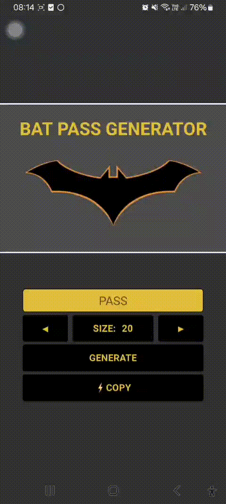

<div align="center">
  <a href="#">
      
  </a>

  <h1 align="center">Bat Password Generator (Improved Version)</h1>

  <p align="center">
    An app to generate strong passwords.
    <br />
    <a href="https://github.com/ismaelldiias/react-native-bat-pass-generator/issues">Report Bug</a>
    ·
    <a href="https://github.com/ismaelldiias/react-native-bat-pass-generator/issues/new">Request Feature</a>
  </p>
</div>

## 📌 About the Project

This app was originally created as part of the **React Native Developer Training** by [Digital Innovation One (DIO)](https://www.dio.me/).

The instructor [Felipe Aguiar](https://github.com/felipeAguiarCode) proposed the challenge **"Batman Password Sequencer with React Native"**, a fun project designed for the fictional company **Wayne Enterprises**.

This repository is a **fork** of the instructor's project, where I implemented improvements and additional features.

## 👀 Preview

<div align="center">
  <a href="#">
      
  </a>
</div>

## 🔥 Features

- [x] Generate a strong random password
- [x] Copy password to clipboard
- [x] **(New)** Password must include:
  - At least **1 uppercase letter**
  - At least **1 lowercase letter**
  - At least **1 number**
  - At least **1 special character**
- [x] **(New)** User can choose password length between **4 and 20 characters**

## 🛠 Technologies

- [React Native](https://reactnative.dev/)
- [Expo](https://docs.expo.dev/)

## 🚀 Building

You'll need [Node.js](https://nodejs.org) installed on your computer in order to build this app.

```bash
git clone https://github.com/ismaelldiias/react-native-bat-pass-generator.git
$ cd react-native-bat-pass-generator
$ npm install
$ npm run start
```

## 📱 Usage

🔧 Run the script

```bash
$ npm run start
```

Runs the app in the development mode.<br/>

## ✨ Authors

| Original Author | Maintainer & Improvements |
|:---------------:|:-------------------------:|
| [<br><sub>Felipe Aguiar</sub>](https://github.com/felipeAguiarCode)<br>[LinkedIn](https://www.linkedin.com/in/felipe-aguiar-exe) | [<br><sub>Ismael Dias</sub>](https://github.com/ismaelldiias)<br>[LinkedIn](https://www.linkedin.com/in/ismaelldiias/) |

